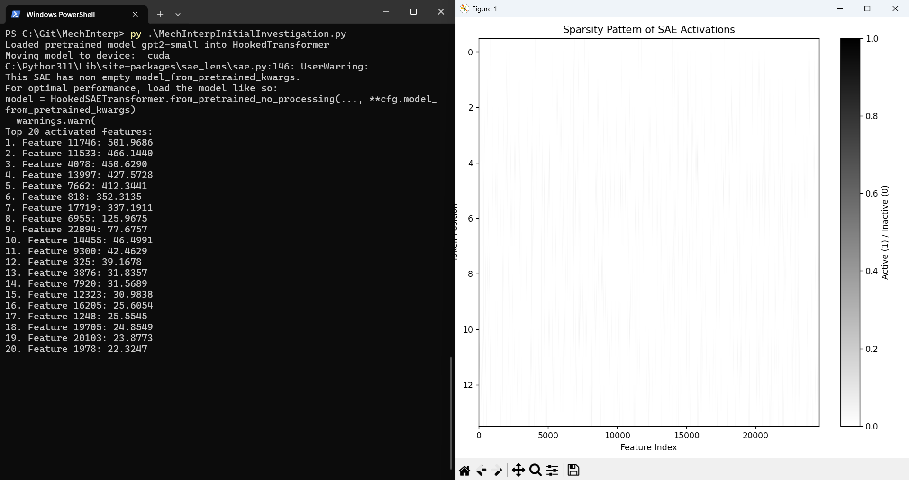
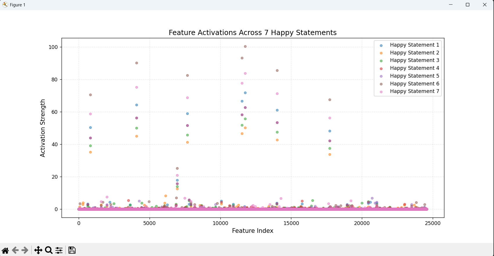

# Mechanistic Interpretability
Mechanistic Interpretability Research  

# Introduction
What is Mechanistic Interpretability (Mech Interp)?  
It's a developing field focusing on the understanding of AI models, especially neural networks (NN).
An NN AI model takes in input, and after being processed through a transformer, is passed through
the "Hidden Layers".  Depending on the exact architecture used, it can be densely connected neurons
that will activate based on the activations in the previous layer.  With Mech Interp we intend to
derive meaning from the weights and activations.

This is a fun and still largely unexplored field!  I expect there will be huge contributions to this
field coming soon that will even enhance AI training, performance, quality, safety, alignment, and
much more.  The more we can deeply understand AI, the more we can use it effectively to help ourselves
and our world.  You don't need a supercomputer or ten GPUs to make an advancement in this field, just
a few python scripts and a small model, as we will see! 

If interested please look into these papers to have a better understanding:  
https://transformer-circuits.pub/2024/scaling-monosemanticity/index.html  
https://transformer-circuits.pub/2022/toy_model/index.html  
https://arxiv.org/pdf/2406.04093

Now let's define some basic concepts to get started!
Feature: A singular segmented and specific concept than a model understands.
Polysemanticity: Any neuron can potentially activate even for multiple features.  It seems that a
combination of neuron activations are needed to trigger a certain feature in a model.
Sparse Autoencoder: A type of encoder that allows us to force sparsity, meaning that it requires
an individual neuron or a sparse set of neurons to fire for a given neuron.

You should also brush up on Python, NumPy, Basics of Transformers/Neural Networks, and Statistics
before working through this.

# Initial Investigation
Let's just get started in the easiest way possible, we will be looking at gpt2-small so we have a
model that can actually run locally.  We will also be using "sae_lens" which is a library with a
whole set of pretrained Sparse Autoencoders we can use!  And indeed they have one for gpt2-small.

So let's take a look at and try running it locally: [Mech Interp Initial Investigation Script](./MechInterpInitialInvestigation.py)

Looking through the code, we are first loading in the models.  Then we set our own input text,
which can be any string!  After that we need to "hook" the activations.  This is so we can pass
in the activations from whatever hidden layer we specify, we are specifying "blocks.8.hook_resid_pre"
here.  This is the 8th transformer block out of 12.

We have some understanding of the different block layers:
Earlier layers (e.g., blocks.0-4)
Capture low-level features, such as individual words, syntax, and basic token relationships.

Mid-level layers (e.g., blocks.5-8, like blocks.8.hook_resid_pre)
Capture phrase-level or concept-level features, like subject-verb-object structures or common phrases.
Still fairly interpretable, but more abstract than earlier layers.

Later layers (e.g., blocks.9-11, final residual stream)
Capture the most abstract and high-level semantic representations before generating output.
These layers decide the final meaning of a sentence in the context of a conversation.

Finally, we can take the stored activations after it ran through gpt2 and then extracted the features in
the Sparse Autoencoder!  Running in the terminal it printed out the top 20 features most activated by 
our input.  And the image is showing us on the y axis the input text that was tokenized compared to on the
x axis, the feature indices.  Remember, the features were given to use by sae_learn as they already trained
and prepared this.  It is unsupervised, so it is up to us to figure out what these features actually mean.
And in fact, some of the features may not mean much they may just be basic innate concepts to us.  You can
also see the Sparse Autoencoder has succeeded in keeping the features sparse.  There are over 7000 features,
but the output just shows thin lines.  This is good!  Each of those thin lines shows along which token positions
the feature is being activated for.

So now with this, the opportunities are endless!  And what Anthropic was able to do in their paper is
attach more meaning to a feature by trying out many different prompts and finding overlap of feature activation.
So let's try this out ourselves in a new script!

Extra Credit:  
I highly recommend checking out [Transluce Monitor](https://monitor.transluce.org/dashboard/chat), this is a startup
that has created an interactive dashboard to investigate individual features of a model!  Although they have just a
few examples it highlights how powerful this research can be.

# Mapping Features to Meaning
Now let's try making some actual discoveries now that we understand the basics!  To do this we need to think about
the tools that we have at our disposal.  We can input text to the model, we can analyze the feature activations,
and (I am assuming) we have some basic understanding of statistics and numpy.  So what we can do is iteratively pass
in different prompts and try to force certain features to activate as mentioned previously.  Then we analyze the
results to prove that with a high statistical probability that this feature is being activated due to properties
of the prompt.

Let's create happy prompts, angry prompts, and baseline prompts.  The baseline should just be random statements which
will help us to see which features are activated consistently.  As mentioned before, sometimes there are features that
may just be activated due to common concepts such as using a noun in a sentence.  If you played around with the prompt
yourself you probably discovered the top few features are always consistently there, so we do not want to attribute
this to the concepts we are trying to force with our own prompts.

Let's get started: [Mech Interp Feature Meaning Script](./MechInterpFeatureMeaning.py)

Effectively we start out by doing the same thing as last time, except on a 7 prompts for happy, angry, and baseline.
Then let's print out these results so we can take a look at the features and cluster them.  Let's also visualize the
happy statements:

It is difficult to visualize the difference between the different statements here as the top 8 features always have
such high activations.  So we will actually want to remove these, as we saw in the printed outputs these are always
appearing so they are general activations that are occurring.

Coming Soon:  
This chapter is not finished yet!  We still have more to explore such as "Statistics to determine feature activation"

# Coming Soon: Training Our Own SAE
Coming Soon:  
Learn about the cfg dict, feature dict  
Train our own SAE  

# Coming Soon: Feature to Weights on a Model

# Coming Soon: Ablating/Stimulating a Model

# Coming Soon: MORE